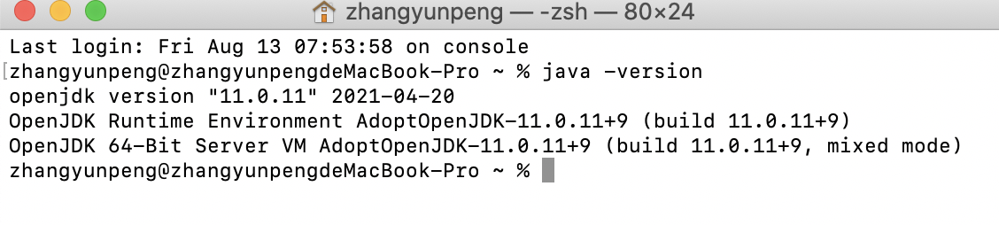

# 安装流程

## 1. 环境要求

首先检查电脑上的jdk版本是否是64位的jdk8-11

检查方式如下

打开命令行工具运行java -version命令并察看结果，在执行Java -version输出的信息就可以看的出来如果是64位的jdk的话就会有

Java HotSpot(TM) 64-Bit Server VM 的这种提示，如果是32位的jdk呢 就会是这样的提示：Java HotSpot(TM) Client  VM

## 2. 操作顺序

### 2.1 安装nacos

首先查看nacos中的readme文件按照顺序安装nacos注册中心并运行，成功之后在进行下一步

### 2.2 安装redis-windows

虽然我们在前面的课程中使用虚拟机安装过redis，但是分布式项目运行所占用的内存比较大服务众多，所以我们尽量避免虚拟机对我们抢占的空间过大，并且我们的项目中redis使用的是非集群版本，所以我们使用当前的windows绿色版redis可以保证尽量的减小内存占用