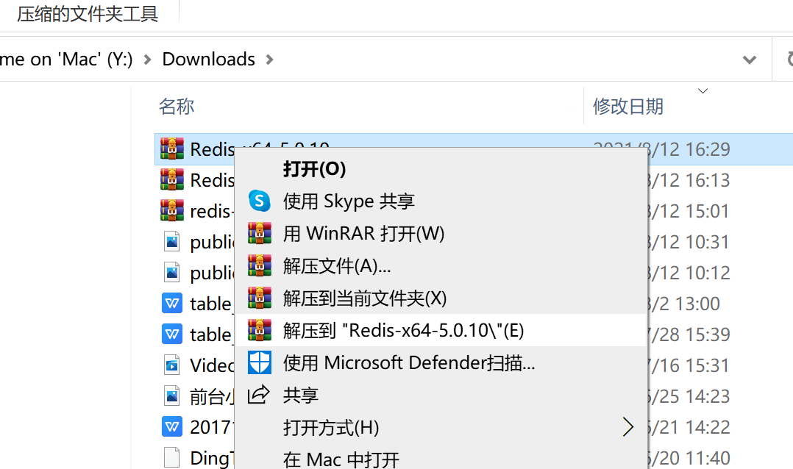
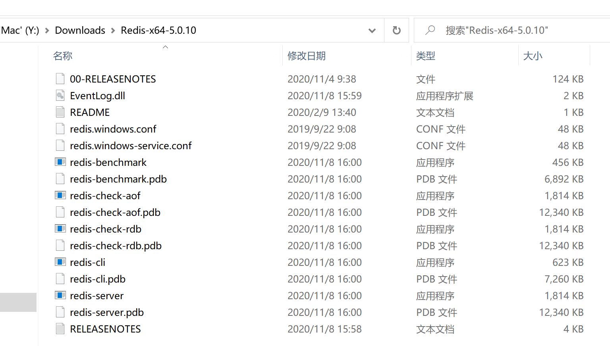
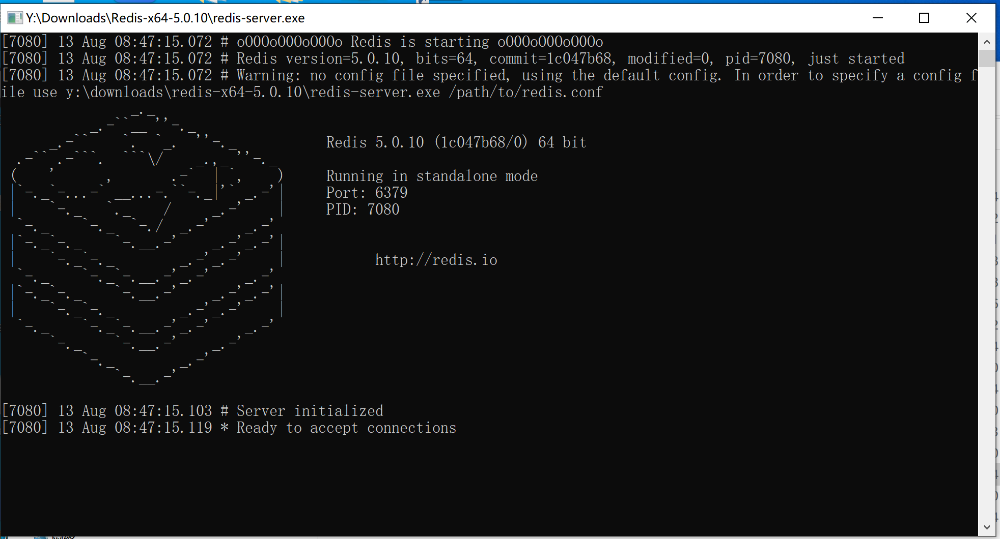
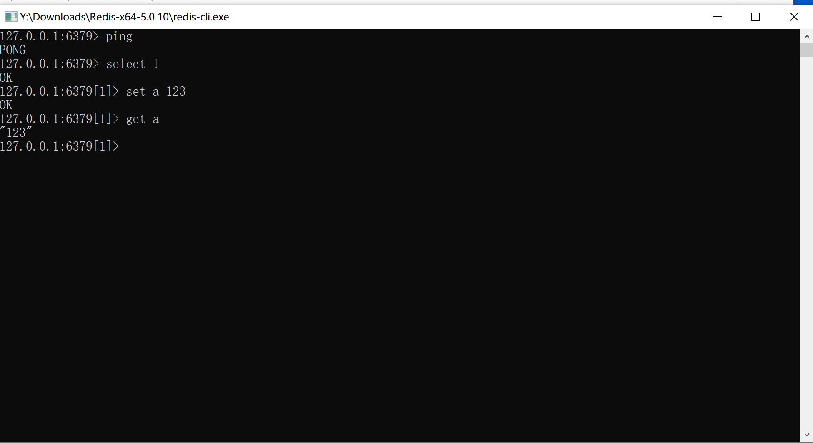

# Redis安装

1. 将redis-windows中的压缩包移动到一个靠谱的目录下并且右键解压到当前文件夹

   

2. 打开文件目录如下

   

3. 双击redis-server运行，此时会弹出如下效果

   

4. 出现上图效果代表当前redis启动成功**（注意：redis-server 窗口不可以关闭否则服务就会停止）**

5. 接下来可以尝试使用redis-cli.exe操作测试redis是否可用

   

6. 到此代表redis启动成功，默认无密码，端口是6379

